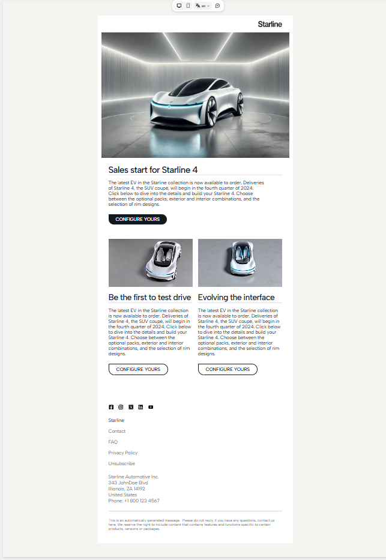

# HTML Email Template (Built with Tabular.email)

This is a responsive HTML email template created using [Tabular.email](https://tabular.email), a visual email builder that makes it easy to design table-based HTML emails.

## About Tabular.email
Tabular Email Template Builder is an email marketing tool that enables users to create HTML email templates with a drag-and-drop editor. You can find many free email templates like this one and design your own email template using ready-to-use modules.

## Features
- Fully responsive table-based layout
- Compatible with major email clients
- Clean, semantic HTML generated by Tabular

## Usage
1. Download or clone this repository.
2. Open `index.html` in your email editor or campaign platform.
3. Customize the HTML for your own needs.

## Credits
This template was designed and exported using [Tabular.email](https://tabular.email).

## License
This template is licensed under the MIT License. Attribution to Tabular.email is required when using or redistributing this template.

## Preview

